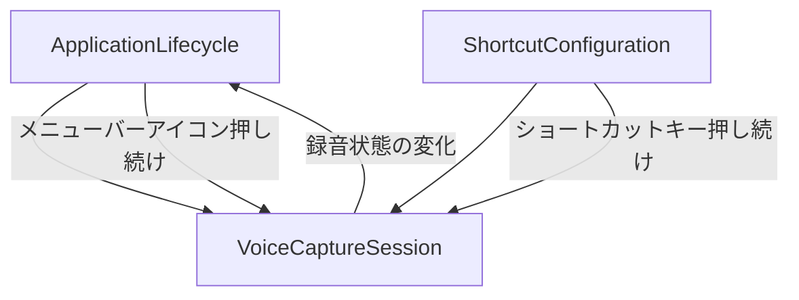

# Unit 1 コンポーネント間の相互作用

## 概要

Unit 1（音声キャプチャ・操作制御）内部のコンポーネント間の関係と、Unit 2（音声認識エンジン）および Unit 3（テキスト処理・出力）への境界インターフェースを定義する。

---

## Unit 1 内部のコンポーネント関係図

---

## Unit 1 内部の相互作用

### ApplicationLifecycle → VoiceCaptureSession

| 相互作用 | 説明 |
|---|---|
| メニューバーからの音声キャプチャ開始 | メニューバーアイコンの押し続けにより VoiceCaptureSession.startCapture() を呼び出す |
| メニューバーからの音声キャプチャ停止 | メニューバーアイコンの解放により VoiceCaptureSession.stopCapture() を呼び出す |

### VoiceCaptureSession → ApplicationLifecycle

| 相互作用 | 説明 |
|---|---|
| 録音状態の通知 | VoiceCaptureSession の CaptureStatus 変化時に ApplicationLifecycle.updateIconState() を呼び出し、メニューバーアイコンの表示を更新する |

### ShortcutConfiguration → VoiceCaptureSession

| 相互作用 | 説明 |
|---|---|
| ショートカットキーからの音声キャプチャ開始 | 設定されたファンクションキーの長押しにより VoiceCaptureSession.startCapture() を呼び出す |
| ショートカットキーからの音声キャプチャ停止 | 設定されたファンクションキーの解放により VoiceCaptureSession.stopCapture() を呼び出す |

---

## 境界インターフェース（Unit 1 → Unit 2）

### 関係タイプ: Customer-Supplier（Unit 1 が上流）

Unit 1 は音声データストリームと制御信号を Unit 2 に供給する。

| インターフェース名 | 方向 | データ | 説明 |
|---|---|---|---|
| AudioStreamOutput | Unit 1 → Unit 2 | 音声データストリーム | マイクからキャプチャされたリアルタイム音声データ |
| CaptureControlSignal | Unit 1 → Unit 2 | CaptureStarted / CaptureStopped イベント | 音声キャプチャの開始・停止を通知する制御信号 |

---

## 境界インターフェース（Unit 1 → Unit 3）

### 関係タイプ: Conformist（Unit 1 が上流）

Unit 1 はアクティブウィンドウの情報を Unit 3 に共有する。

| インターフェース名 | 方向 | データ | 説明 |
|---|---|---|---|
| ActiveWindowInfo | Unit 1 → Unit 3 | アクティブウィンドウ情報（アプリケーション名、テキストフィールド情報） | テキストの直接入力先を特定するためのアクティブウィンドウ情報 |
