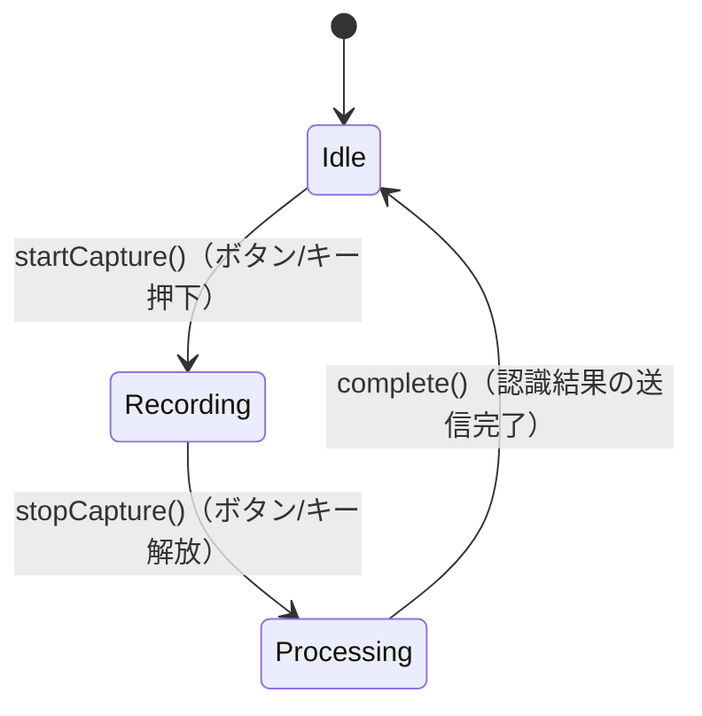

# VoiceCaptureSession（音声キャプチャセッション）

## 概要

音声入力の1回のセッション（開始→録音→停止）を表すドメインモデル。ユーザーがプッシュトゥトーク操作を行うたびに1つのセッションが生成される。

対応ユーザーストーリー: **US-001**（音声認識の開始と停止 — プッシュトゥトーク方式）

---

## コンポーネント種別

**エンティティ（Entity）**

---

## 属性

| 属性名 | 型 | 説明 |
|---|---|---|
| sessionId | 一意識別子 | セッションを一意に識別するID |
| status | CaptureStatus（値オブジェクト） | 現在の録音状態 |
| startedAt | タイムスタンプ | セッション開始時刻 |
| stoppedAt | タイムスタンプ（nullable） | セッション停止時刻（録音中はnull） |
| audioStream | 音声データストリーム | マイクから取得中の音声データ |

---

## 値オブジェクト

### CaptureStatus（録音状態）

セッションの現在状態を表す値オブジェクト。

| 値 | 説明 |
|---|---|
| Idle | 待機中（録音していない） |
| Recording | 録音中（ボタン/キーが押されている） |
| Processing | 停止処理中（ボタンを離した直後、音声データを認識エンジンへ送信中） |

---

## 振る舞い

| メソッド | 説明 | 事前条件 | 事後条件 |
|---|---|---|---|
| startCapture() | 音声キャプチャを開始する | status が Idle であること | status が Recording に遷移し、マイクからの音声入力が開始される |
| stopCapture() | 音声キャプチャを停止する | status が Recording であること | status が Processing に遷移し、音声データストリームがUnit 2へ送信される |
| complete() | セッションを完了する | status が Processing であること | status が Idle に遷移し、stoppedAt が設定される |

---

## 状態遷移図

---

## ドメインイベント

| イベント名 | 発生タイミング | ペイロード | 備考 |
|---|---|---|---|
| CaptureStarted | startCapture() 実行時 | sessionId, startedAt | Unit 2 へ音声ストリームの送信開始を通知 |
| CaptureStopped | stopCapture() 実行時 | sessionId, stoppedAt, audioStream | Unit 2 へ音声ストリームの送信停止を通知 |
| CaptureCompleted | complete() 実行時 | sessionId | セッションの完了を通知 |

---

## ビジネスルール

1. セッションは常に Idle → Recording → Processing → Idle の順で遷移する（スキップ不可）
2. 同時に複数のセッションを Recording 状態にすることはできない
3. ボタン/キーを「押し続けている間」のみ Recording 状態を維持する（プッシュトゥトーク）
4. メニューバーアイコンのクリックも同じプッシュトゥトーク方式で動作する
