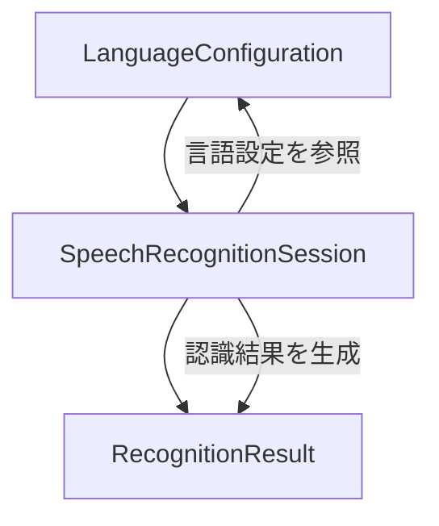

# Unit 2 コンポーネント間の相互作用

## 概要

Unit 2（音声認識エンジン）内部のコンポーネント間の関係と、Unit 1（上流）および Unit 3（下流）との境界インターフェースを定義する。

---

## Unit 2 内部のコンポーネント関係図

---

## Unit 2 内部の相互作用

### LanguageConfiguration → SpeechRecognitionSession

| 相互作用 | 説明 |
|---|---|
| 言語設定の提供 | SpeechRecognitionSession が StartRecognition する際に、LanguageConfiguration から有効な言語のリストを取得する |
| 混合認識モードの判定 | isMultiLanguageEnabled() の結果に基づき、単一言語認識モードか日英混合認識モードかを決定する |

### SpeechRecognitionSession → RecognitionResult

| 相互作用 | 説明 |
|---|---|
| 認識結果の生成 | 音声認識処理の完了時に RecognitionResult を生成し、認識されたテキストを言語ごとのセグメントに分割して格納する |

---

## 境界インターフェース（Unit 1 → Unit 2）

### 関係タイプ: Customer-Supplier（Unit 1 が上流）

Unit 1 から音声データストリームと制御信号を受け取る。

| インターフェース名 | 方向 | データ | 説明 |
|---|---|---|---|
| AudioStreamInput | Unit 1 → Unit 2 | 音声データストリーム | マイクからキャプチャされたリアルタイム音声データを受信 |
| CaptureControlSignal | Unit 1 → Unit 2 | CaptureStarted / CaptureStopped イベント | 音声キャプチャの開始・停止イベントを受信し、SpeechRecognitionSession を制御する |

### イベントマッピング

| Unit 1 イベント | Unit 2 の対応アクション |
|---|---|
| CaptureStarted | SpeechRecognitionSession.startRecognition() を呼び出す |
| CaptureStopped | SpeechRecognitionSession.stopRecognition() を呼び出す |

---

## 境界インターフェース（Unit 2 → Unit 3）

### 関係タイプ: Customer-Supplier（Unit 2 が上流）

Unit 3 へ認識結果テキストを供給する。

| インターフェース名 | 方向 | データ | 説明 |
|---|---|---|---|
| RecognitionResultOutput | Unit 2 → Unit 3 | RecognitionResult（fullText + segments） | 認識完了後の結果テキストを送信。セグメント情報と完全テキストの両方を含む |

### イベントマッピング

| Unit 2 イベント | Unit 3 の対応アクション |
|---|---|
| RecognitionFinalized | テキストリライト処理を開始する |
