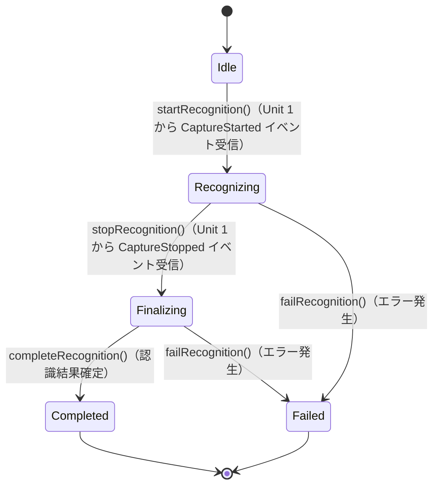

# SpeechRecognitionSession（音声認識セッション）

## 概要

Unit 1 から受け取った音声データストリームを処理し、認識結果（RecognitionResult）を生成する一連の処理フローを管理するドメインモデル。音声データの受信開始から認識完了までのライフサイクルを制御する。

対応ユーザーストーリー: **US-002**（日本語認識）、**US-003**（英語認識）、**US-004**（日英混合認識）

---

## コンポーネント種別

**エンティティ（Entity）**

---

## 属性

| 属性名 | 型 | 説明 |
|---|---|---|
| sessionId | 一意識別子 | 認識セッションを一意に識別するID（Unit 1 の VoiceCaptureSession と対応） |
| status | RecognitionStatus（値オブジェクト） | 現在の認識処理状態 |
| languageConfiguration | LanguageConfiguration への参照 | この認識セッションで使用する言語設定 |
| result | RecognitionResult（nullable） | 認識結果（認識完了後にのみ設定される） |

---

## 値オブジェクト

### RecognitionStatus（認識処理状態）

音声認識処理の現在状態を表す値オブジェクト。

| 値 | 説明 |
|---|---|
| Idle | 待機中（音声データ未受信） |
| Recognizing | 認識中（音声データを受信し、リアルタイム認識処理中） |
| Finalizing | 最終化中（音声入力停止後、最終認識結果を確定中） |
| Completed | 完了（認識結果が確定済み） |
| Failed | 失敗（認識処理中にエラーが発生） |

---

## 振る舞い

| メソッド | 説明 | 事前条件 | 事後条件 |
|---|---|---|---|
| startRecognition(audioStream) | 音声データストリームの受信を開始し、認識処理を開始する | status が Idle であること | status が Recognizing に遷移し、音声データの認識処理が開始される |
| stopRecognition() | 音声データの受信を停止し、最終認識結果の確定処理に入る | status が Recognizing であること | status が Finalizing に遷移する |
| completeRecognition(result) | 認識結果を確定する | status が Finalizing であること | status が Completed に遷移し、result に RecognitionResult が設定される |
| failRecognition(error) | 認識処理の失敗を記録する | status が Recognizing または Finalizing であること | status が Failed に遷移する |

---

## 状態遷移図

---

## ドメインイベント

| イベント名 | 発生タイミング | ペイロード | 備考 |
|---|---|---|---|
| RecognitionStarted | startRecognition() 実行時 | sessionId, enabledLanguages | 認識処理の開始 |
| RecognitionFinalized | completeRecognition() 実行時 | sessionId, RecognitionResult | Unit 3 へ認識結果を送信 |
| RecognitionFailed | failRecognition() 実行時 | sessionId, エラー情報 | エラーハンドリング |

---

## ビジネスルール

1. SpeechRecognitionSession は Unit 1 の VoiceCaptureSession と1対1で対応する
2. 認識処理は LanguageConfiguration で設定された言語に基づいて動作する
3. 複数言語が有効な場合は日英混合認識モードで動作し、言語の切り替わりを自動検出する
4. 認識結果は RecognitionResult として言語ごとのセグメントに分割される
