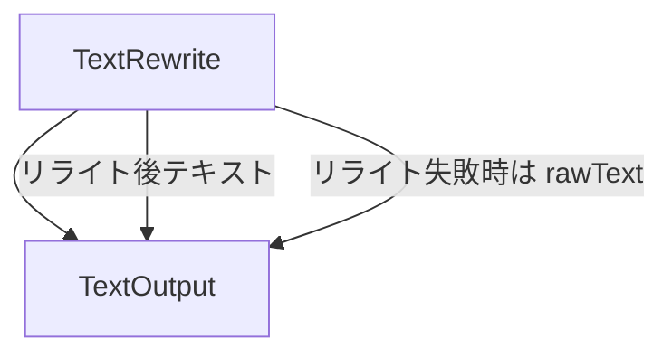
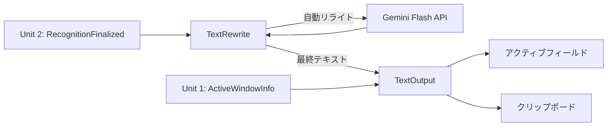

# Unit 3 コンポーネント間の相互作用

## 概要

Unit 3（テキスト処理・出力）内部のコンポーネント間の関係と、Unit 2（上流）および Unit 1 からの入力インターフェースを定義する。

---

## Unit 3 内部のコンポーネント関係図

---

## Unit 3 内部の相互作用

### TextRewrite → TextOutput

| 相互作用 | 説明 |
|---|---|
| リライト完了テキストの送信 | TextRewrite の RewriteCompleted イベント発生時に、TextOutput.executeOutput() を呼び出し、リライト後テキストを出力する |
| リライト失敗時のフォールバック | TextRewrite の RewriteFailed イベント発生時に、rawText を TextOutput.executeOutput() に渡してフォールバック出力する |

---

## 境界インターフェース（Unit 2 → Unit 3）

### 関係タイプ: Customer-Supplier（Unit 2 が上流）

Unit 2 から認識結果テキストを受け取る。

| インターフェース名 | 方向 | データ | 説明 |
|---|---|---|---|
| RecognitionResultInput | Unit 2 → Unit 3 | RecognitionResult（fullText + segments） | 認識完了後のテキストデータを受信。TextRewrite の rawText として使用する |

### イベントマッピング

| Unit 2 イベント | Unit 3 の対応アクション |
|---|---|
| RecognitionFinalized | TextRewrite エンティティを生成し、rawText に認識結果の fullText を設定。自動でリライト処理を開始する |

---

## 境界インターフェース（Unit 1 → Unit 3）

### 関係タイプ: Conformist（Unit 1 が上流）

Unit 1 からアクティブウィンドウ情報を受け取る。

| インターフェース名 | 方向 | データ | 説明 |
|---|---|---|---|
| ActiveWindowInfo | Unit 1 → Unit 3 | アクティブウィンドウ情報（アプリケーション名、テキストフィールド情報） | TextOutput がアクティブフィールドへテキストを入力する際の出力先を特定するために使用する |

---

## 全体データフロー（Unit 3 視点）

