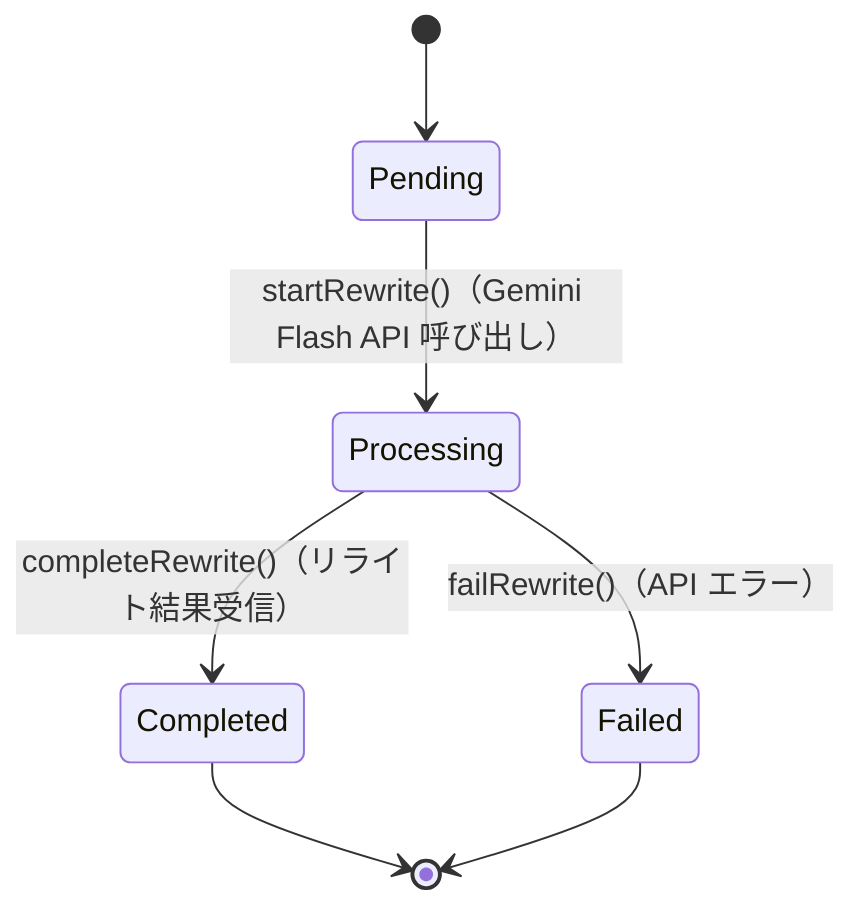

# TextRewrite（テキストリライト）

## 概要

音声認識で生成されたテキストを Gemini Flash API でリライト・精度補正するドメインモデル。リライトは常に自動で実行され、リライト前のテキスト（raw テキスト）も保持する。

対応ユーザーストーリー: **US-006**（Gemini Flash によるテキストリライト）

---

## コンポーネント種別

**エンティティ（Entity）**

---

## 属性

| 属性名 | 型 | 説明 |
|---|---|---|
| rewriteId | 一意識別子 | リライト処理を一意に識別するID |
| rawText | 文字列 | リライト前のテキスト（音声認識エンジンの出力そのまま） |
| rewrittenText | 文字列（nullable） | リライト後のテキスト（リライト完了後に設定） |
| status | RewriteStatus（値オブジェクト） | リライト処理の現在状態 |
| sourceRecognitionResultId | 一意識別子 | 元の RecognitionResult への参照 |

---

## 値オブジェクト

### RewriteStatus（リライト処理状態）

リライト処理の状態を表す値オブジェクト。

| 値 | 説明 |
|---|---|
| Pending | リライト待ち（認識結果を受信済み、API呼び出し前） |
| Processing | リライト処理中（Gemini Flash API に送信中） |
| Completed | リライト完了（リライト後テキストが確定） |
| Failed | リライト失敗（API エラーなど） |

---

## 振る舞い

| メソッド | 説明 | 事前条件 | 事後条件 |
|---|---|---|---|
| startRewrite() | Gemini Flash API へテキストを送信し、リライト処理を開始する | status が Pending であること | status が Processing に遷移する |
| completeRewrite(rewrittenText) | リライト結果を設定し、処理を完了する | status が Processing であること | status が Completed に遷移し、rewrittenText が設定される |
| failRewrite(error) | リライト処理の失敗を記録する | status が Processing であること | status が Failed に遷移する |
| getFinalText() | 最終的に使用するテキストを返す | — | Completed の場合は rewrittenText、Failed の場合は rawText を返す |
| getRawText() | リライト前の元テキストを返す | — | rawText を返す |

---

## 状態遷移図

---

## ドメインイベント

| イベント名 | 発生タイミング | ペイロード | 備考 |
|---|---|---|---|
| RewriteStarted | startRewrite() 実行時 | rewriteId, rawText | Gemini Flash API の呼び出し開始 |
| RewriteCompleted | completeRewrite() 実行時 | rewriteId, rawText, rewrittenText | テキスト出力処理を開始する通知 |
| RewriteFailed | failRewrite() 実行時 | rewriteId, エラー情報 | rawText をフォールバックとして使用 |

---

## ビジネスルール

1. リライトは常に自動で実行される（ユーザーによる有効/無効の切り替えはない）
2. リライト前のテキスト（rawText）は常に保持される
3. フィラーワード（えーと、あのー、um、uh など）はリライト時に自動除去される
4. 文法的に正しいテキストに自動修正される
5. 日英混合テキストも適切にリライトされる
6. リライトが失敗した場合は、rawText をフォールバックとして使用する
