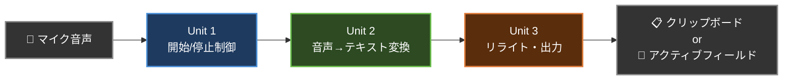

# コンテキストマップ（Context Map）

## 概要

音声入力アプリの3つの境界づけられたコンテキスト（Unit of Work）間の関係性を示します。

---

## コンテキストマップ図

```mermaid
flowchart LR
    subgraph U1["🎙️ Unit 1\n音声キャプチャ・操作制御"]
        direction TB
        U1_S1["US-001: プッシュトゥトーク"]
        U1_S2["US-008: メニューバー常駐"]
        U1_S3["US-009: グローバルショートカット"]
    end

    subgraph U2["🗣️ Unit 2\n音声認識エンジン"]
        direction TB
        U2_S1["US-002: 日本語認識"]
        U2_S2["US-003: 英語認識"]
        U2_S3["US-004: 日英混合認識"]
        U2_S4["US-005: 言語設定"]
    end

    subgraph U3["📝 Unit 3\nテキスト処理・出力"]
        direction TB
        U3_S1["US-006: Gemini Flash リライト"]
        U3_S2["US-007: クリップボードコピー"]
        U3_S3["US-010: アクティブフィールド入力"]
    end

    U1 -- "音声データストリーム\n（開始/停止制御）" --> U2
    U2 -- "認識テキスト" --> U3
    U1 -. "入力先コンテキスト\n（アクティブウィンドウ情報）" .-> U3

    style U1 fill:#1e3a5f,stroke:#4a90d9,stroke-width:3px,color:#ffffff
    style U2 fill:#2d4a22,stroke:#6abf4b,stroke-width:3px,color:#ffffff
    style U3 fill:#5a2d0c,stroke:#e07b39,stroke-width:3px,color:#ffffff
```

---

## 関係性の説明

| 上流（Upstream） | 下流（Downstream） | 関係タイプ | データフロー |
|---|---|---|---|
| Unit 1: 操作制御 | Unit 2: 音声認識 | Customer-Supplier | 音声データストリームと開始/停止制御信号を供給 |
| Unit 2: 音声認識 | Unit 3: テキスト処理 | Customer-Supplier | 認識されたテキストデータを供給 |
| Unit 1: 操作制御 | Unit 3: テキスト処理 | Conformist | アクティブウィンドウ／テキストフィールド情報を共有 |

---

## データフロー

